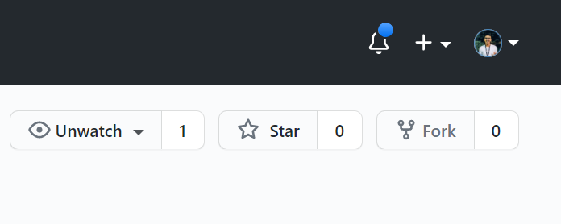
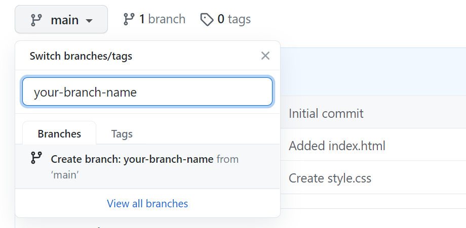

# Git-For-Freshers
A repository with a bunch of simple tasks to help guide beginners about open-source

#### Facing any difficulties with the task assigned to you? You can the pen below for reference
<pre>
<a href="https://codepen.io/ishandeveloper/pen/wvoBPxy">codepen.io/ishandeveloper/pen/wvoBPxy</a>
</pre>

## How To Contribute?
It's very easy. You don't need to be an expert in coding and programming.

Here are the steps to follow :

1. Find an issue in the 'Issues' tab above, that you'd like to work on.
2. Comment down on the issue you're interested, and wait till the admin assigns you that issue.
3. If an issue is already assigned to someone else, kindly look for other available issues.

### Once you've been assigned an issue.

#### 4. Fork this repository by click the Fork button in the top right of this page or just [click here](https://github.com/DSC-ChitkaraUniv/Git-For-Freshers/fork). Feel free to leave a star, if you'd like.

  
 
#### 5. Click on branch tab on top-left, and create a new branch with your name.

  

#### 6. Open index.html and first make sure you're on the new branch, then click on the edit icon.

#### 7. Make and commit your changes.

#### 8. **Submit your changes for review**
   If you go to your forked repository on GitHub, you'll see a `Compare & pull request` button. Click on that button.

   

   * Now submit your pull request, by clicking the `Create Pull Request` button.

If the above guide was tough for you to follow, you can follow the instructions [here](https://www.digitalocean.com/community/tutorials/how-to-create-a-pull-request-on-github).

## That's it! 
#### You've succesfully created your first Pull Request and made your first contribution to the open source community!
